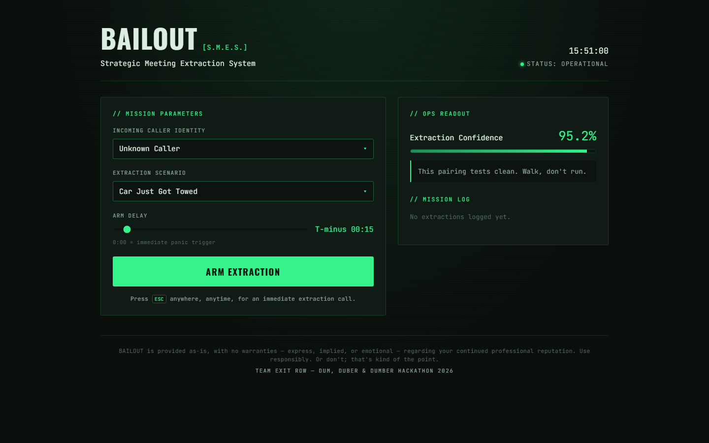

# BAILOUT

**Finally, the Escape key does what it says.**

BAILOUT is a Strategic Meeting Extraction System: a deliberately over-engineered fake incoming-call generator for escaping meetings that should have ended already.

## What it does

- Select a believable caller and extraction scenario.
- Choose a delayed trigger or press `Esc` for an immediate panic call.
- Ring and vibrate like a real incoming call.
- Speak each conversation cue through a hands-free audio coach, including the final exit line.
- Calculate an extraction-confidence score and keep a mission log.

## Run the MVP

Open `index.html` directly in any modern browser. The complete MVP is self-contained and requires no installation, account, server, or API key.

## Submission files

- `index.html` - standalone application
- `output/BAILOUT_Pitch_Deck.pptx` - five-slide pitch deck
- `output/BAILOUT_2_MIN_PITCH.txt` - two-minute speaking script
- `output/DEVPOST_COPY.txt` - submission copy
- `output/BAILOUT_Submission.zip` - complete handoff package

Built by Team Exit Row for the Dum, Duber & Dumber Hackathon 2026.
